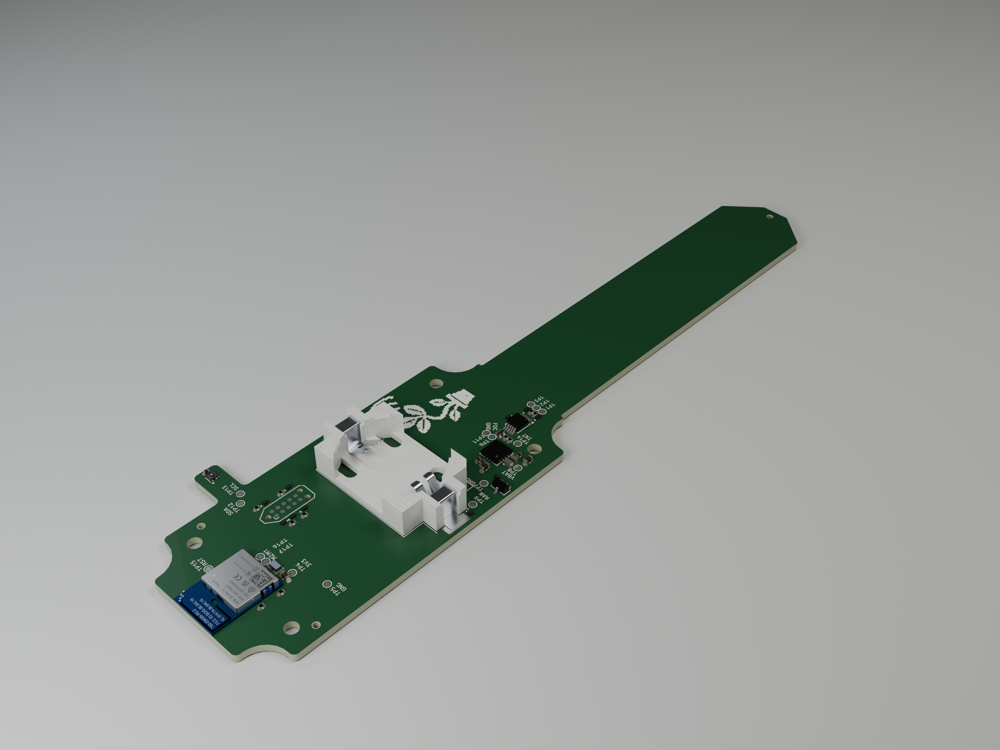

# nRF Moisture Sensor



A CR2032-powered Bluetooth soil-moisture sensor with **two capacitive sensing zones**, a dedicated TI FDC1004 capacitance-to-digital converter, and temperature/humidity sensing. Built around the Ezurio BL54L15 (Nordic nRF54L15), it broadcasts BTHome v2 readings for Home Assistant and supports local BLE configuration and firmware updates.

This repository contains the KiCad hardware, embedded firmware, browser configuration dashboard, and prototype investigation notes.

## Why build another soil sensor?

The goal is a self-contained, coin-cell-powered sensor that measures two regions of the probe independently and sends readings directly over BLE. A dedicated capacitance converter exposes raw capacitance for diagnosis and calibration, while the radio and sensing circuit can spend most of their time off.

- **Two sensing zones:** SENSE1 and SENSE2 have independent measurements and dry/wet calibration endpoints. Both are soil-sensing areas; SENSE2 is not an air-reference pad.
- **Dedicated measurement hardware:** the FDC1004 converts capacitance to digital readings over I²C, with raw values available in femtofarads. The probe does not depend on the MCU ADC to measure an analog moisture voltage.
- **A complete wireless device:** the MCU, BLE radio, battery power management, and probe are on the board. BTHome advertisements carry both moisture values, temperature, humidity, battery voltage, and estimated battery percentage.
- **Designed around a coin cell:** the nPM2100 supplies the board, the FDC1004 rail is switched off between measurements, and the nRF54L15 uses timed System OFF between wakes. Production defaults are a measurement every 15 minutes and a 5-second advertising window; saved settings can override these.
- **Local configuration:** a Web Bluetooth dashboard reads raw measurements and saves names, intervals, and per-zone calibration. Application updates use MCUboot and MCUmgr/SMP over BLE.
- **Separate environmental sensing:** a Sensirion SHT40 measures temperature and relative humidity.

Battery lifetime, soil accuracy, and long-term outdoor reliability are still being characterized. These are architectural choices, not a measured claim of better battery life or accuracy than commercial products.

## How it compares

**Y** = included in the device; **N** = not included. Connectivity refers to this project's current firmware and the competitors' stock functionality (the BLE sample for b-parasite). An external host or replacement firmware can add capabilities.

| Feature | This project | [Seeed XIAO](https://wiki.seeedstudio.com/xiao_soil_moisture_sensor/) | [Adafruit STEMMA](https://www.adafruit.com/product/4026) | [Chirp!](https://wemakethings.net/chirp/) | [b-parasite](https://github.com/rbaron/b-parasite) |
| --- | :---: | :---: | :---: | :---: | :---: |
| Capacitive soil sensing | Y | Y | Y | Y | Y |
| Two independently read soil-sensing zones | Y | N | N | N | N |
| Dedicated capacitance-to-digital converter IC | Y | N | N | N | N |
| Operates without an additional controller | Y | Y | N | Y | Y |
| BLE moisture broadcasting in supplied firmware | Y | N | N | N | Y |
| Wi-Fi reporting in supplied firmware | N | Y | N | N | N |
| Onboard coin-cell power support | Y | N | N | Y | Y |
| Onboard AA battery power support | N | Y | N | N | N |
| Relative humidity measurement | Y | N | N | N | Y |
| Audible watering alarm | N | N | N | Y | N |

The main hardware differences behind those marks:

- **This project:** FDC1004 measurement front end, BL54L15 / nRF54L15 MCU and BLE radio, nPM2100 power management, CR2032 battery, and SHT40 temperature/humidity sensor.
- **Seeed XIAO:** one capacitive probe with analog output read by the ESP32-C6 ADC; stock ESPHome firmware reports over Wi-Fi; powered by one AA battery. The ESP32-C6 has BLE-capable hardware, so the BLE **N** above describes stock moisture reporting, not a missing radio.
- **Adafruit STEMMA:** one sensing area measured using the ATSAMD10's built-in capacitive-touch peripheral, with digital I²C output. The ATSAMD10 runs the seesaw sensor interface ([schematic: IC1](https://github.com/adafruit/Adafruit-STEMMA-Soil-Sensor-PCB/blob/master/Adafruit%20STEMMA%20Soil%20Sensor.sch)); an additional controller is required to retrieve and use readings, along with external 3–5 V power.
- **Chirp:** one sensing area, an analog RC filter / peak detector read by the ATtiny44 ADC, and digital I²C readout. It operates independently as an audible watering alarm on a CR2032, without BLE.
- **b-parasite:** a CR2032-powered nRF52840/nRF52833 design with one soil-sensing zone, SHTC3 temperature/humidity sensing, and ambient light sensing. Its BLE sample supports BTHome and Home Assistant. The [soil measurement code](https://github.com/rbaron/b-parasite/blob/main/code/prstlib/src/adc.c) drives the sensing circuit with PWM and reads its analog output through the MCU ADC; it does not use a dedicated capacitance-to-digital converter.

Seeed's [store listing](https://www.seeedstudio.com/XIAO-Soil-Sensor-p-6452.html) showed **US$10.90** when checked on September 27, 2026; pricing varies. Its AA/ESP32-C6/Wi-Fi approach differs from this board's CR2032/BLE design, but an ESP32 alone does not establish poor battery life. A fair comparison requires measured energy per wake and equivalent reporting intervals.

Adafruit provides digital I²C readings but requires an additional controller to use them. Chirp uses an analog RC/peak-detector front end and the MCU ADC, but exposes readings digitally over I²C. b-parasite already shares the coin-cell, BLE/BTHome, and temperature/humidity features. The main distinctions from b-parasite are this board's dedicated FDC1004 measurement front end and two independently read sensing zones.

## Prototype status

Hardware bring-up, BTHome advertising, persistent BLE configuration, and application OTA have been exercised on prototypes. The current normal sensor firmware is **0.2.28**. This is an experimental design, not a qualified production sensor.

**SENSE2 soil response is still under investigation.** Both channels respond to a hand-grip test, but SENSE2 has shown a much weaker response in soil. The [investigation record](docs/sense2-investigation-2026-09-25.md) separates observations from possible causes and remaining tests.

The current dry/wet endpoints are provisional water references. Reported moisture percentages are relative to those endpoints, not validated volumetric water content. Battery lifetime, supply transients, coating/enclosure behavior, and repeatable soil calibration still need physical qualification. Older design reviews describe earlier board states; use the maintained schematic/PCB and current firmware documentation when working on the hardware.

## Getting started

### Hardware

Open [nrf-moisture-sensor.kicad_pro](nrf-moisture-sensor.kicad_pro) in KiCad. The maintained schematic and PCB are authoritative; retired full-design generators must not overwrite them.

- [Bill of materials](BOM.md)
- [Hardware design rationale](HARDWARE.md)
- [Historical schematic PDF](docs/schematic-review-2026-09-05/nrf-moisture-sensor-schematic.pdf)

### Firmware

Use **Nordic nRF Connect SDK v3.2.2**. From the repository root, in an SDK-configured environment:

```sh
west build --sysbuild -p always -b bl54l15_dvk/nrf54l15/cpuapp \
  -d firmware/sensor/build firmware/sensor
sh firmware/sensor/tests/run.sh
```

See the [sensor firmware guide](firmware/sensor/README.md) for wiring, development cadence, signing, OTA, and SWD recovery. The SDK signing key is for development only; use a protected production key for field releases. The [older DK demo](firmware/bthome-sensor/README.md) is separate from the sensor firmware.

### Browser configuration

With Node.js installed, run:

```sh
node firmware/sensor/dashboard/serve.mjs
```

Open <http://127.0.0.1:8766> in Chrome or Edge on a Bluetooth-capable computer. Connect during the sensor's advertising window, or use **Explore with demo data** to inspect the interface without hardware. No npm install is required.

The [dashboard guide](firmware/sensor/dashboard/README.md) covers configuration and calibration. Firmware uploads use a separate SMP client.

## Development records

- [Power and configuration audit](docs/power-and-configuration-2026-09-21.md)
- [Low-voltage behavior](docs/low-voltage-investigation-2026-09-21.md)
- [BTHome recovery](docs/bthome-recovery-2026-09-22.md)
- [Dual-pad diagnosis](docs/soil1-dual-pad-diagnosis-2026-09-24.md)
- [SENSE2 investigation](docs/sense2-investigation-2026-09-25.md)

Some investigation records refer to local raw captures in ignored output directories; those captures are not included in this repository.
