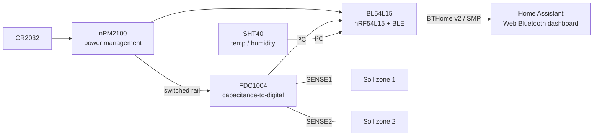

# moisture-sensor


A CR2032-powered Bluetooth soil-moisture sensor with two capacitive sensing zones. An FDC1004 capacitance-to-digital converter measures the probe, an Ezurio BL54L15 (nRF54L15) broadcasts BTHome v2 readings for Home Assistant, and an SHT40 adds temperature and humidity. Configuration and firmware updates happen over BLE.

**Status:** experimental prototype, firmware 0.2.28. SENSE2 shows a weaker response in soil than SENSE1 ([investigation](docs/sense2-investigation-2026-09-25.md)). Moisture percentages are relative to provisional dry/wet endpoints, and battery life and soil accuracy are not yet characterized.

## How it differs

**Y** = included in the device; **N** = not included. Connectivity reflects stock firmware (the BLE sample for b-parasite); other firmware or an external host can add capabilities.

| Feature | This project | [Seeed XIAO](https://wiki.seeedstudio.com/xiao_soil_moisture_sensor/) | [Adafruit STEMMA](https://www.adafruit.com/product/4026) | [Chirp!](https://wemakethings.net/chirp/) | [b-parasite](https://github.com/rbaron/b-parasite) |
| --- | :---: | :---: | :---: | :---: | :---: |
| Capacitive soil sensing | Y | Y | Y | Y | Y |
| Two independently read soil-sensing zones | Y | N | N | N | N |
| Dedicated capacitance-to-digital converter IC | Y | N | N | N | N |
| Operates without an additional controller | Y | Y | N | Y | Y |
| BLE moisture broadcasting in supplied firmware | Y | N | N | N | Y |
| Wi-Fi reporting in supplied firmware | N | Y | N | N | N |
| Onboard coin-cell power support | Y | N | N | Y | Y |
| Onboard AA battery power support | N | Y | N | N | N |
| Relative humidity measurement | Y | N | N | N | Y |
| Audible watering alarm | N | N | N | Y | N |

## Block diagram



## Build

### Hardware

Open [nrf-moisture-sensor.kicad_pro](nrf-moisture-sensor.kicad_pro) in KiCad. The maintained schematic and PCB are authoritative. See the [BOM](BOM.md) and [design rationale](HARDWARE.md).

### Firmware

Requires Nordic nRF Connect SDK v3.2.2. From the repository root, in an SDK-configured environment:

```sh
west build --sysbuild -p always -b bl54l15_dvk/nrf54l15/cpuapp \
  -d firmware/sensor/build firmware/sensor
sh firmware/sensor/tests/run.sh
```

Wiring, signing, OTA, and SWD recovery are in the [sensor firmware guide](firmware/sensor/README.md). The SDK signing key is for development only.

### Browser configuration

```sh
node firmware/sensor/dashboard/serve.mjs
```

Open <http://127.0.0.1:8766> in Chrome or Edge. Connect during the sensor's advertising window, or use **Explore with demo data** without hardware. See the [dashboard guide](firmware/sensor/dashboard/README.md).

## Notes

Investigation records are in [docs/](docs/).
