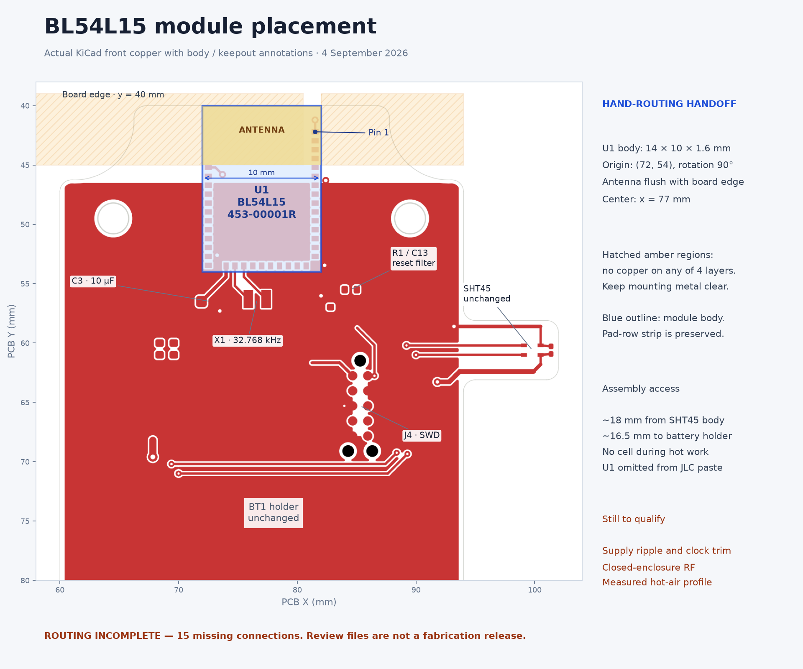
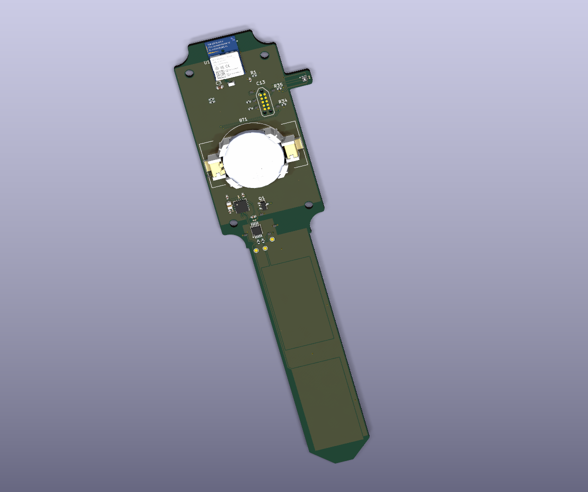

# BL54L15 integration — 2026-09-04

**Actual schematic and PCB migrated; routing handoff, not a fabrication release.**
Alex will hand-route the remaining digital/power connections. All unrelated
net connectivity, outline and retained peripheral placement were checked
against the dirty working-tree snapshot taken before this migration.
See [changed files](changed-files.md), [verification](verification.md), [manufacturing workflow](manufacturing.md),
[current BOM](../../BOM.md) and [firmware requirements](../../firmware/BL54L15-port.md).

## Selected module and verified assets

U1 is **Ezurio 453-00001R**, BL54L15 with integrated PCB antenna,
[DigiKey cut tape 776-453-00001RCT-ND](https://www.digikey.com/en/products/detail/ezurio/453-00001R/26224851).
The BL54L15µ and MHF4 versions are not alternatives. Body is nominally
14 × 10 × 1.6 mm; 39 LGA pads on three sides.

Source of truth is the current [Ezurio BL54L10/BL54L15 datasheet](https://www.ezurio.com/documentation/datasheet-bl54l10-and-bl54l15-series),
accessed 2026-09-04, especially Pin-Out, Power Supply, Mechanical Drawings,
Host PCB Land Pattern and Antenna Keep-Out, Circuit Checklist, PCB Layout and
Surface Mount Modules. This is a living HTML datasheet; the source image
identifiers and hashes are in [source-manifest.json](source-manifest.json).

The project-local symbol is `lib/ezurio.kicad_sym`; the footprint is
`lib/footprints.pretty/Ezurio_BL54L15_453-00001.kicad_mod`.
They were constructed from the manufacturer's pin table and dimensioned
**top-view host land drawing**, not from a similarly named module or the old QFN.
The STEP file `lib/BL54L15_453-00001.step` is the detailed Ezurio model from the
user-supplied 453-00001 trace-antenna ZIP, retained byte-for-byte. The board,
local footprint and model repair mapping use offset (0, -10, 0.40116) mm with
unit scale and zero rotation. This seats the underside lands on the host PCB
and aligns pin 1 and the antenna with the land pattern. See
[model provenance and coverage](model.json) and [mechanical drawing](mechanical-453-00001.pdf).
The old envelope file is retained only for historical snapshots.

## What is integrated and what remains external

| Function | In module | Host action |
|---|---|---|
| SoC main DC/DC | Inductor, filter and DECD/DECA/DECRF support shown inside module power diagram | Remove L1, FB1, C1/C2/C4/C5/C7/C8/C10/C12 and their internal-rail nets |
| Supply bypass | Internal rail decoupling does not replace required host input reservoir | Retain C3, mandatory 10 µF at pad26; 0603 16 V X6S |
| High-frequency clock | 32 MHz crystal; load bank inside SoC | Remove X2 and XC1/XC2; configure internal HFXO loading |
| Low-frequency clock | LFRC and configurable LFXO load banks; no fitted 32.768 kHz crystal | Retain X1 at pads25/24 for timed System OFF wake; tune internal bank |
| RF | Matching network and integrated PCB antenna; no host RF pin | Remove L2/L3/L4/C6/C9/C11, AE1, R27/C29, NT1/NT2 and all RF feed/return nets |
| Reset | Internal pull-up/brownout circuitry | Keep series R1 and C13 filter and J4/PMIC reset topology |
| I²C/programming | SoC interfaces only | Retain R22/R23 pull-ups and all J4 connections |

The CR2032/nPM2100, L10 and C21–C28, FDC1004, SHT45, driven shields, sensing
routes, battery removal corridor and enclosure outline remain. C3/R1/C13 lands
were made standard 0603/0402 to match actual orderable passives.

**Power release gate:** the 3.3 V architecture is retained, but Ezurio's 10 mV
noise/ripple condition is tighter than nPM2100 LP/ULP's typical ripple. Firmware
must hold HP through radio windows and the actual board must be measured.
Direct host VOUT capacitance is 12.3 µF nominal; at +20% that is 14.76 µF before
module capacitance. Effective capacitance includes bias loss and tolerance;
verify the converter's 0.7–15 µF range with the complete load. The published
module block diagram does not specify every component's capacitance, so this
upper-limit check is explicitly unresolved. LDOSW is supplied from VINT, so C26/C28 are not directly part of
the VOUT capacitance sum; assess their startup load separately on VINT. Extra capacitors are not a safe
assumed fix. C23's separate VINT bias qualification remains open from before.

## Pin audit

All used GPIO assignments are preserved. NC means intentionally unconnected
in both schematic and PCB; it does not mean a power pin was omitted.

| Pad | Module function | Carrier net / destination |
|---|---|---|
| 1 | GND | GND |
| 2 | P2.09 | NC |
| 3 | P2.08 | NC |
| 4 | P2.07/SWO | P2.07_SWO / J4.6 |
| 5 | SWDIO | SWDIO / J4.2 |
| 6 | SWDCLK | SWDCLK / J4.4 |
| 7 | nRESET | NRESET / R1.1, C13.1 |
| 8 | P2.02 | NC |
| 9 | P2.00 | NC |
| 10 | P2.01 | NC |
| 11 | P2.04 | NC |
| 12 | P2.05 | NC |
| 13 | P2.03 | NC |
| 14 | P1.03/NFC2 | NC |
| 15 | P1.02/NFC1 | NC |
| 16 | GND | GND |
| 17 | P0.00 | PMIC_INT / U2.5 |
| 18 | P0.01 | NC |
| 19 | P0.02 | NC |
| 20 | P1.07 | MARK1 / TP16 (timing marker) |
| 21 | P1.06 | MARK2 / TP17 (timing marker) |
| 22 | P1.05 | FDC_SDA |
| 23 | P1.04 | FDC_SCL |
| 24 | P1.01/XL2 | XL2 / X1.2 |
| 25 | P1.00/XL1 | XL1 / X1.1 |
| 26 | VDD_nRF | +3V3 / C3.1 |
| 27 | GND | GND |
| 28 | P1.10 | SDA / PMIC, FDC1004, SHT45 |
| 29 | P1.09 | NC |
| 30 | P1.08 | NC |
| 31 | P0.04 | NC |
| 32 | P1.14 | NC |
| 33 | P1.13 | NC |
| 34 | P1.12 | NC |
| 35 | P1.11 | SCL / PMIC, FDC1004, SHT45 |
| 36 | P0.03 | NC |
| 37 | P2.10 | NC |
| 38 | P2.06 | NC |
| 39 | GND | GND |

## Land geometry, orientation and keepouts

See the [current zone simplification](../zone-simplification/README.md): the
antenna rule area now follows only the hatched region in Figure 11.

Local footprint origin is the top-left of the manufacturer's top-view body.
Body x=0..14, y=0..10 mm; the antenna is toward x=14. All lands are
0.45 × 0.60 mm. Pad1 is (11.8,9.497), then pads2..16 step −0.75 mm in x;
left-side pads17..27 are (0.5,8.75) stepping −0.75 mm in y, rotated 90°;
pads28..39 are (0.55,0.503) stepping +0.75 mm in x. Pin39=(8.8,0.503).
The pin-1 dot is beside pad1 on the antenna-side end of the bottom row.

The PCB transforms this with origin **(72,54), rotation90°**:
`board_x=72+local_y`, `board_y=54−local_x`. Thus the body is x72..82, y40..54,
antenna end y40 flush with the host edge, centered at x77. Pin1 is
(81.497,42.2), VDD26=(74,53.5), XL1=(74.75,53.5), XL2=(75.5,53.5).

The manufacturer's hatched keepout is local x9..14, y0..8.5, extended
15 mm beyond local y=0. Figure 11's lower ≥15 mm dimension does not identify
another copper-free region below the pad row. The previously added right-hand
exclusion was an incorrect interpretation and has been removed.

The rotated rule area is x57..80.5, y39..45, on all four copper layers, banning
tracks, vias, pads and fills. Ground extends to the right of x80.5, including
the module ground-land strip. The existing pad-39 notch is retained.

Drawing edge case: pad39's 0.45 mm width reaches local x9.025 while the nominal
keepout starts at x9.0. The rule area has a **0.026 mm notch only at that exact
manufacturer ground land** (board x72.196..72.810), retaining the full land and
avoiding a contradictory pad-in-keepout check. It is not permission to put other
copper in the antenna area. All other copper stays outside the defined areas.
No vias may expose solder mask under the module except the required LGA lands.

The fixed 34 mm carrier is smaller than Ezurio's antenna characterization board.
The outline, 1.6 mm thickness, mounting reliefs and Hammond enclosure were
preserved. Keep antenna-end screws nylon and keep wires, metal coatings and
hardware out of the antenna zone. Manufacturer guidance recommends metal
separation of 40 mm above/below and 30 mm left/right in its antenna drawing;
metal within 20 mm is particularly detrimental. The nearest holder body is
about 25.5 mm from the antenna region (about 16.5 mm from the module body).
**The fixed enclosure/battery design does not satisfy all preferred metal
clearances.** No unqualified RF-compliance claim is made. Test the closed
assembly with cell, lid, screws and representative soil; redesign enclosure
metal spacing if performance is inadequate. Module certification alone does
not qualify the finished host product.

## Hand fitting with paste and hot air

U1 is required in the finished product, but schematic and PCB mark it DNP for
JLC. It is absent from JLC BOM/positions and JLC paste; all copper and mask lands
remain. The module-only paste export provides a local stencil pattern.
The module has underside LGA pads; an iron cannot reliably reach the joints.

C3 and X1 are immediately behind the module, with room to approach from the
board edge. SHT45 remains on its jut, about 18 mm from the module body. This
separation helps shield it, but does not establish a safe thermal exposure.
Fit U1 before the battery holder if consignment/assembly sequencing permits;
otherwise protect the holder and confirm its thermal limit. **Never heat with
a CR2032 cell installed.** Keep programming and battery-removal access clear.

Use a local stencil (Ezurio recommends thickness ≥0.1 mm), controlled paste
volume, ESD handling, clean lands, exact pin-1 alignment and low airflow.
A nozzle with controlled preheating should bring every underside joint to
reflow without displacing C3/X1. Shield SHT45 and its PTFE membrane from direct
heat and flux; do not wash/contaminate its opening. Use a thermocouple at the
module and a qualification coupon/representative board to establish the joint
profile; nozzle setpoint is not package temperature. Inspect for alignment,
bridges and opens, then check resistance and current-limited power/SWD. For
hidden-joint confidence, use X-ray where available; visual edge inspection
alone cannot establish every LGA joint's quality.

Ezurio specifies a reflow profile measured at the IC surface: ramp 40–130°C
under 2.5°C/s, preheat 130–180°C for 60–120 s, ramp 180–220°C under 3°C/s,
peak ≤250°C with 225–250°C for 30–50 s, cooling under 3°C/s. Adapt the paste
process within all component limits. The datasheet's hot-air instructions are
for **module removal**, not a validated hand-assembly recipe; do not copy the
330°C nozzle or 280°C hotplate removal settings as an assembly profile.
Manual hot-air attachment is the intended prototype process and remains to be
qualified; a reflow oven is not assumed.

The module is MSL4. Track exposure after opening (72 hours maximum under the
specified dry-pack conditions), keep unused cut tape dry, and follow the
supplier humidity indicator and baking instructions if exceeded. Any module
bake is before assembly and must not be applied indiscriminately to the carrier,
cell, holder or humidity sensor. See the vendor's current material-handling
section for its 125°C/48 h bake condition and packaging restrictions.

## Routing handoff

The [In2 ground conversion](../in2-ground/README.md) now provides ground
beneath bottom-layer signals. All +3V3 connections are routed; 11 existing
signal connections remain. Its endpoint list and DRC report supersede the
power-routing status and anchors below.

Only short XL1/XL2, C3-to-VDD and local ground connections were completed.
Remaining ratlines are deliberate at Alex's request. Preserve the crystal
routes without signal vias, minimize clock loop area, and avoid clocks/SW nodes
under them. Complete module power, reset, SWD/SWO, I²C and PMIC interrupt routes;
join retained trunk anchors or delete obsolete stubs after rerouting. The
current DRC report lists each endpoint. Do not route any layer through the
antenna keepouts or split In1 GND beneath the module.

Useful preserved anchors in absolute mm: SCL on B.Cu at (72.197,68.803), SDA on
B.Cu at (71.1,68.5), PMIC_INT on B.Cu at (80.3,61.4), SWD_RST on F.Cu at
(85.0405,58.725), main +3V3 near (67.8325,68.2), and the J4 +3V3 branch at
(81.24,61.6625). They are routing starting points, not evidence of connectivity.

## Vendor model preview

Preview uses a derived board with assembly exclusions cleared for display.
The maintained board retains U1’s separate hand-fit/JLC exclusion flags; enable
excluded/DNP models in the 3D viewer to display it. All 39 module lands were
checked against the footprint (maximum XY difference 0.00321 mm). Nine model
coverage tests pass; PCB content changed only in U1’s model path and offset.
