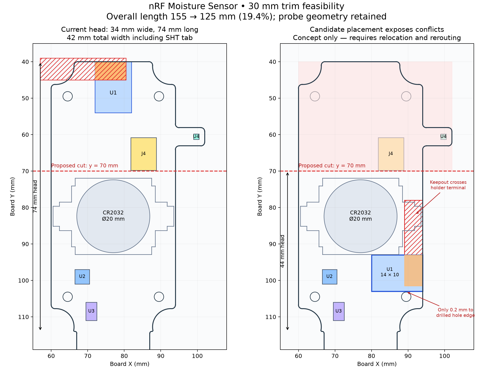

# Board shrink feasibility — 2026-09-05

**Removing about 30 mm of head length is a reasonable layout exploration, but
moving only the module beside the lower-right mounting hole does not produce
a viable placement.** The module's antenna keepout crosses the current battery
holder terminal, and the hole leaves insufficient practical assembly clearance.
This review proposes no changes to the maintained PCB.

The figure uses current Edge.Cuts and footprint `transform/translate/rotate`
positions. Module and battery geometry are dimensioned; J4 is a simplified
access envelope and the other IC rectangles omit their passive clusters.
Red hatching is antenna copper exclusion; red shading is the proposed removed
region. The candidate deliberately exposes conflicts, not a routed design.
[SVG](shrink-concept.svg) · [reproducible generator](shrink-concept.py)

## Dimensions and candidate

| Dimension | Present | Cut at board y=70 mm |
|---|---|---|
| Overall length, through probe tip y=195 | 155 mm (top y=40) | 125 mm; reduction 30 mm / 19.4% |
| Electronics head length, to y=114 shoulder | 74 mm | 44 mm; reduction 40.5% |
| Main head width | 34 mm, x=60–94 | 34 mm retained |
| Full existing width, including SHT tab | 42 mm, x=60–102 | Depends on replacement SHT tab |
| Probe width and length | 20 mm nominal; y≈114–195 | Retained |
| Mounting hole centers | x=64.5/89.5, y=49.5/104.5; Ø2.6 mm | Both y=49.5 holes removed |

The battery is centered at (77,82.4). Its coin-cell diameter is 20 mm, and its
actual stepped holder courtyard extends to x=60.5–93.5 and y=71.95–92.85.
Thus a y=70 edge leaves only **1.95 mm to the existing holder courtyard**, not
an empty 4 mm margin inferred from just the narrow holder body. Check insertion,
removal, plastic wall thickness and edge clearance with the exact 3D assembly.

A concrete test placement puts the 14×10 mm module at **x=80–94, y=93–103**,
rotation 0°, antenna facing the right edge. With the manufacturer's keepout
interpretation already recorded in [module integration](../bl54l15/README.md),
its antenna exclusion is x=89–94, y=78–101.5. That crosses the right-hand battery
holder terminal/courtyard near y=80–85. Ground, pads and traces in that region
cannot remain. Moving the module farther down encounters the lower-right
corner relief and hole; moving it left loses the right-edge antenna position.

The lower-right hole center is (89.5,104.5). Its drilled edge is only **0.2 mm**
from the candidate module body edge at y=103. This is not enough for a screw
head, module courtyard, assembly tooling or tolerances. The antenna region is
also only about **3 mm** from the hole center. A metallic screw there is far
inside the module vendor's preferred metal separation. Nylon hardware avoids
that particular metal object but does not fix the holder or mechanical overlap.

## What must move or be redesigned

- Relocate J4, its protection/reset components, U1's C3/X1/reset support, and
  the SHT45 tab and bypass. These presently sit above y=70. Reserve actual
  Tag-Connect probe-body access and registration-hole clearance, not merely
  the ten electrical pads.
- Rework mounting/enclosure support. Removing the two upper holes breaks the
  existing 25×55 mm four-post attachment pattern. A shorter board in the same
  enclosure needs a deliberate support arrangement; the enclosure itself does
  not become shorter when PCB material is removed.
- Co-design battery position, antenna orientation and the right-hand mounting
  feature. This can require shifting the battery/PMIC, removing or moving the
  lower-right hole, or allocating a dedicated antenna protrusion. Each option
  must preserve the manufacturer's antenna exclusion rather than fit only the
  module's body rectangle.
- Keep the FDC1004 at the probe shoulder, CIN paths short, and driven shields
  intact. Preserve the probe electrode and shield geometry for the first shrink
  study so that electronics relocation does not also change sensing calibration.
  Keep antenna grounds and PMIC switching currents out of the probe guard region.
- Relocate the SHT45 onto a thermally isolated, exposed tab away from the radio,
  converter and battery metal. Packing it against the module would worsen its
  temperature measurement and complicate hot-air module attachment.

An alternative antenna orientation must be checked with the **full rotated
keepout**, including its 15 mm extension. It is not enough to rotate a 14×10 mm
box until the bodies no longer overlap. The module vendor's characterized
placement is at a board edge, and corner/battery proximity changes RF behavior.

## Suggested next layout study

Start with a separate 34×44 mm head concept and unchanged probe, then place
mechanical constraints first: cell insertion/removal, mounting, antenna keepout,
SHT exposure and programming access. Try the battery and antenna positions
jointly rather than treating the existing holder location as fixed. Route only
after the clearance study passes. Finish with DRC, 3D interference review and
closed-enclosure radio comparison on a prototype. The current calculation
establishes potential length savings, not that all constraints fit within 44 mm.

Source geometry: current `nrf-moisture-sensor.kicad_pcb`, local BL54L15 and
CR2032-BS-6 footprints, and
[Ezurio BL54L10/BL54L15 integration guidance](https://www.ezurio.com/documentation/datasheet-bl54l10-and-bl54l15-series).
No RF field simulation, reroute or manufactured-board test was performed.
