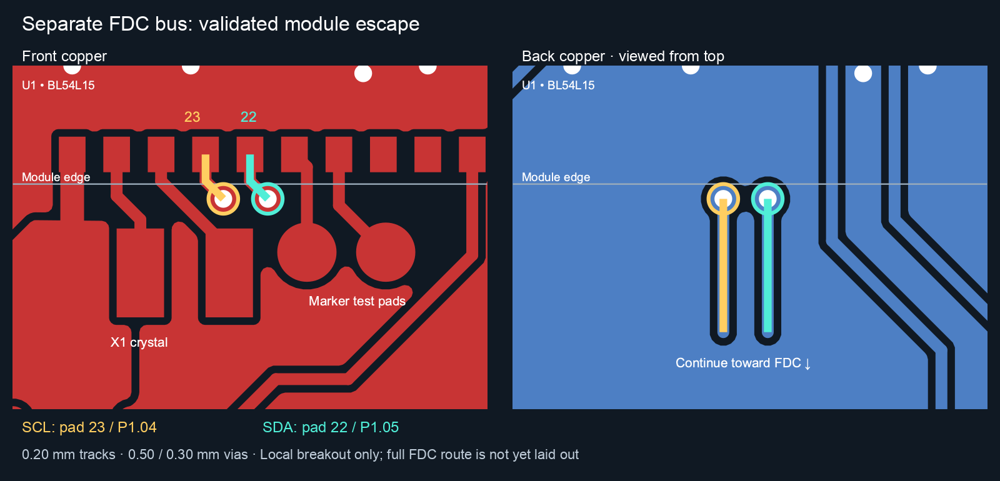

# Dedicated FDC I²C bus feasibility — 2026-09-09

Recommendation: use U1 pad 22 (P1.05) for FDC_SDA and pad 23 (P1.04) for FDC_SCL, on hardware TWIM20. Both pins are unused and emerge from the module edge facing the FDC. Local escape is demonstrated without moving components. This is an evaluation, not an implemented circuit change or completed route.

## Pin and controller selection

| Choice | SDA | SCL | Assessment |
|---|---|---|---|
| Preferred | U1.22 / P1.05 | U1.23 / P1.04 | Adjacent bottom-edge pads, toward FDC; two short front traces and two vias escape to back copper. |
| Alternative | U1.29 / P1.09 | U1.30 / P1.08 | Left-edge pads; validated westward escape, but requires turning south beside the existing bus. |

Module pin mapping: [Ezurio BL54L10/BL54L15 datasheet](https://www.ezurio.com/documentation/datasheet-bl54l10-and-bl54l15-series). P1.04 and P1.08 support the clock function: [Nordic pin table](https://docs.nordicsemi.com/r/bundle/ps_nrf54l15/page/chapters/pin.html-qfn48). TWIM20/21/22 use port P1: [Nordic TWIM documentation](https://docs.nordicsemi.com/r/bundle/ps_nrf54l15/page/twim.html-topic?contentId=ZCNrRd3TXd2U_Zlq48Iw7Q).

Existing main bus uses TWIM22 on P1.10/P1.11. The bring-up overlay and archived built devicetree show TWIM20 is available, with SPI20/UART20 disabled. Keep those shared-instance peripherals disabled when enabling TWIM20. No software I²C is necessary.

## Tested escape geometry

All coordinates are board millimetres. Both traces are 0.20 mm wide; vias are 0.50 mm diameter / 0.30 mm drill (0.10 mm radial annular ring).

- SCL: pad 23 (76.25, 53.50), front trace to (76.25, 53.95), then via at (76.55, 54.25), back trace to (76.55, 56.50).
- SDA: pad 22 (77.00, 53.50), front trace to (77.00, 53.95), then via at (77.30, 54.25), back trace to (77.30, 56.50).

The small diagonal jog matters: a straight SCL escape with a via at (76.25, 54.35) collided with XL2. The recommended placement clears XL2 and the marker pads. The short back traces pass beneath the crystal region; the two intervening ground layers provide separation. Keep those planes continuous in the eventual route.

Both disposable studies ran native KiCad DRC with zone refill, all track errors, and all severities: **0 errors, 106 warnings each**. Only two warnings involve new items: their deliberately unfinished back-track ends. This is not the full-board release/parity check: the studies reuse the existing unused-pin net names, omit the schematic, and do not connect the FDC. Copper exports were separately refilled before visual inspection.

Artifacts: [preferred DRC](study/drc.json), [preferred new-item findings](study/new-item-violations.json), [alternative DRC](left-study/drc.json), [alternative new-item findings](left-study/new-item-violations.json). Scripts reproduce these disposable studies; do not use these boards for fabrication.

## Remaining layout and circuit work

U3 is about 52 mm south of the module pads. A complete trunk still needs routing around ground stitches and existing back-layer debug/reset/PMIC interrupt traces. The local breakout is proven; end-to-end clearance, exact length, pull-up placement, and FDC fanout are not yet proven. Use outer-layer routing while retaining the inner ground planes, and keep away from the converter switching node and sensitive FDC input traces.

Disconnect only the FDC branch from the main bus. Current front-copper spurs are:

- SDA: (68.175, 102.20) → (70.00, 104.025) → U3.10 (70.00, 104.91).
- SCL: (68.825, 101.80) → (70.402, 103.377) → (70.402, 104.812) → U3.9 (70.50, 104.91).

Retain the main bus and R22/R23 for the PMIC and SHT. Add two nominal 4.7 kΩ pull-ups to **+3V3_FDC_SW**, near U3/C26/C28, and connect the new bus exclusively to U3. Confirm final rise time at the intended 100 kHz bus rate on hardware. No isolator IC or switched-rail route up to U1 is required.

## Leakage and firmware implications

This removes the existing always-powered shared-bus pull-ups as a source of FDC back-power. It does not establish a guaranteed zero system leakage current.

1. At boot and while FDC power is off, leave both dedicated pins disconnected/high impedance, with internal pull-ups disabled.
2. Use the main bus to enable the FDC supply; wait for its required startup time, then enable the dedicated bus and configure/read the FDC.
3. Complete transfers and suspend/disconnect TWIM20 pins before turning the FDC supply off. Verify pinctrl sleep and System OFF behaviour, including error paths.
4. Update the carrier transport, currently sharing one bus context, to select TWIM20 for FDC address 0x50 and TWIM22 for PMIC/SHT, or explicitly split those contexts.
5. Measure FDC rail voltage and battery current while off, including main-bus traffic, MCU reset and wake/sleep transitions. A dedicated bus addresses the external pull-up path; residual pin/rail leakage still needs measurement.

The maintained schematic, PCB, rules and firmware were not edited for this feasibility evaluation. D8/D9 remain accepted as previously directed. The fabrication-rule review is recorded separately in ../jlc-vias-i2c-2026-09-09/README.md.
