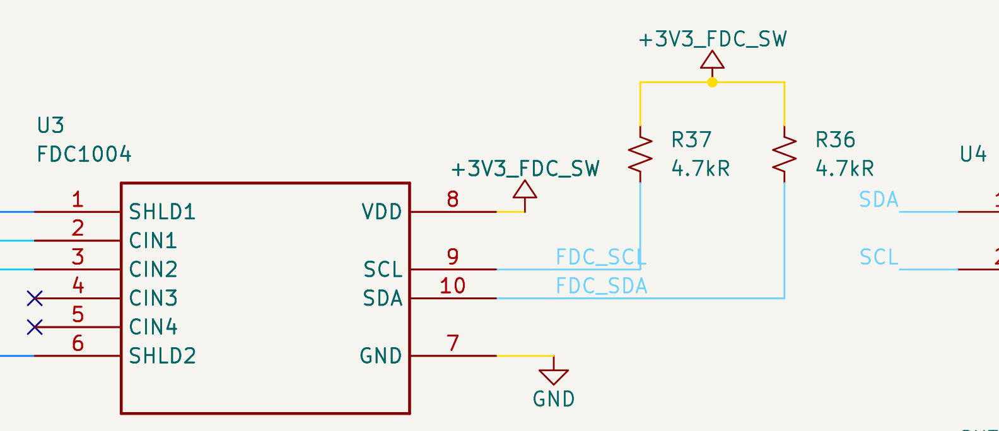
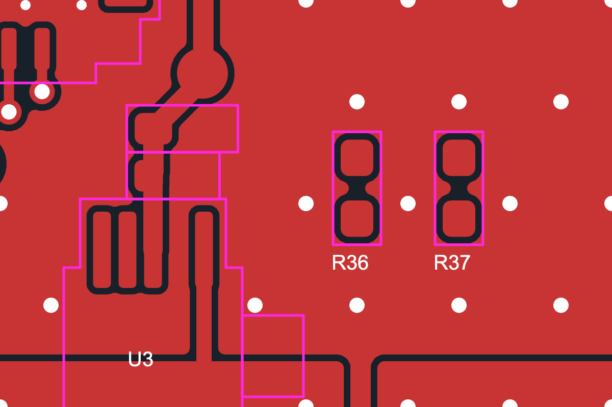

# Dedicated FDC bus — wiring and routing handoff

Implemented 2026-09-09 at the user's request. New connections are intentionally unrouted.

| Net | Module | FDC | Pull-up |
|---|---|---|---|
| /FDC_SDA | U1.22 / P1.05 | U3.10 | R36, 4.7 kΩ to +3V3_FDC_SW |
| /FDC_SCL | U1.23 / P1.04 | U3.9 | R37, 4.7 kΩ to +3V3_FDC_SW |

R36/R37 reuse the existing qualified pull-up part, UNI-ROYAL 0402WGF4701TCE / LCSC C25900, and the same 0402 footprint. Initial PCB positions are (75.0, 103.7) and (77.0, 103.7) mm. Their placement clears existing copper and courtyards; adjust to suit the final route. Both signals use the existing I2C net class.

The PMIC and SHT stay on /SDA and /SCL with R22/R23 pulled up to +3V3. Five former FDC-only branch segments were removed. No new tracks or vias were added. All other footprints, vias and zones are unchanged relative to the saved pre-change board.

## Routing notes

Six ratsnest connections remain: two connections per signal (MCU, FDC and pull-up) and two connections joining the pull-ups to the switched rail. Route these and refill zones before fabrication.

**Upward escape is an option:** leave pads 22/23 toward decreasing board Y, into the module footprint, then change layers to avoid the crystal area below the module. Verify underside clearance and the module land-pattern restrictions; keep outside the antenna keepout and retain continuous inner ground planes. This direction has been documented, not routed or DRC-qualified. The earlier downward escape was only a disposable feasibility study and has not been copied into the maintained PCB. Avoid digital traces running alongside XL1/XL2 and keep the long trunk away from /SW and the FDC CIN inputs.

## Firmware

The carrier qualification image uses TWIM20 for address 0x50 and TWIM22 for PMIC/SHT. SPI20 and UART20 are disabled. TWIM20 has runtime device PM enabled and starts in its sleep state; both default and sleep pinctrl explicitly disable internal bias, and sleep disconnects the pins. The SDK driver resumes for each transfer and synchronously suspends after it, including error returns. FDC transfers begin only after the existing supply-enable/settling sequence. Startup and shutdown both verify runtime PM is enabled and the bus is suspended; failure retains watchdog recovery instead of switching off beneath active pins.

Nordic SDK v3.2.2 build passed: [build log](firmware-build.log), [devicetree](firmware/zephyr.dts), [configuration](firmware/.config), [merged image](firmware/merged.hex). This image targets the updated wiring after routing; the earlier shared-bus binary is obsolete. Electrical leakage and sleep/reset transitions still require bench measurement.

## Verification

- Native schematic netlist comparison shows only the intended bus split and two new pull-ups: [exact changes](net-changes.json).
- Native schematic/PCB parity: **0 mismatches**.
- Refilled native PCB DRC: **0 physical-rule errors**, **6 intentional unrouted errors**, 91 warnings. [Report](drc.json).
- Native ERC: **0 errors, 11 warnings**. Ten concern existing C_Small library copies. One reports a no-connect/GND connection involving unchanged #PWRTP8 and an unchanged no-connect marker; it is outside the changed nets and remains for broader schematic review. [Report](erc.json).
- Carrier host tests passed for measurement, CRC, range, bounded waits and bus-fault cleanup.
- Hardware regression selection: 15 of 16 tests passed. The remaining pre-existing assertion expects SENSE clearance 0.20 mm, but the project already used 0.60 mm before this change (also captured in the previous feasibility study). That clearance was preserved. [Test log](tests.log).
- Visually checked the FDC schematic, module pin labels, and refilled copper/courtyard placement.

No fabrication outputs were regenerated. BOM and hardware/firmware/layout documentation now describe the separate bus. The before directory is an audit snapshot; its copied project settings were added after the edit to support checks and are not a pristine pre-change project-settings snapshot.
