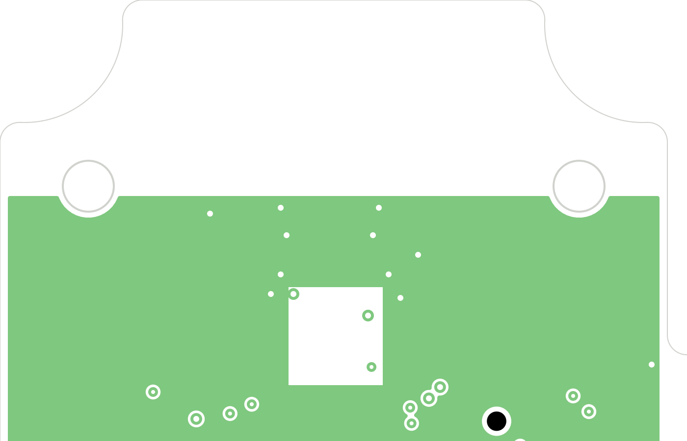

# Integrated antenna conversion — 2026-09-04

The maintained schematic and PCB now replace J5/U.FL and the external Molex
antenna with AE1, a 24 mm bent monopole on the top edge. R27 is an initially
fitted 0 Ω series jumper; C29 is an initially unpopulated shunt tuning position.
The new RF_ANT net is in the RF class. AE1 is excluded from BOM/placement and
has neither paste nor mask openings. The existing radio filter is unchanged.

The antenna is a prototype, not a qualified Nordic reference copy. The board
uses JLC04161H-3313; its recorded core dielectric constant was updated to the
current JLCPCB published 4.6. The existing 0.1565 mm nominal microstrip width
is retained and must be confirmed against the ordered stack by JLCPCB. Antenna
geometry must be tuned independently; CAM must not resize the radiator.

See [LAYOUT.md §3](../../LAYOUT.md#3-antenna-integrated-pcb-monopole-prototype)
for dimensions, source links, changed battery spacing, fabrication notes and
VNA/radiated verification requirements. The enclosure reliefs and every
pre-existing footprint except removed J5 are unchanged.

## Verification

- 36 repository tests passed, including 235 subtests.
- PCB DRC after zone refill: **11 track-width errors and 3 unconnected items**,
  identical error identities to the baseline; no new antenna errors.
- 0 schematic/PCB parity discrepancies; 0 short/clearance/courtyard errors.
- 45 PCB warnings remain (baseline 47): 17 silk-over-copper, 15 silk overlaps,
  12 library footprint differences and 1 dangling track.
- ERC: 0 errors, 24 warnings (baseline 23). C29 inherits the existing
  C_Small cached-library mismatch; the other warning categories are unchanged.
- Netlist changed only at RF_50R (J5.1 replaced by R27.1), GND (J5.2 replaced
  by C29.2), and new RF_ANT (R27.2, C29.1, AE1.1). Fingerprint updated to 63 nets.
- Visual inspection of actual KiCad layer plots confirmed the radiator, feed
  connection, ground boundary and clear inner plane beneath the radiator.

The existing unfinished crystal/power routing must be completed before
fabrication. RF measurements and selection of an orderable R27 / final tuning
parts remain required before production release. No manufacturing order made.

Reports: [DRC](drc.json), [ERC](erc.json).
Pre-conversion copies: `tmp/pcb-antenna/baseline/`.

## Layer previews

