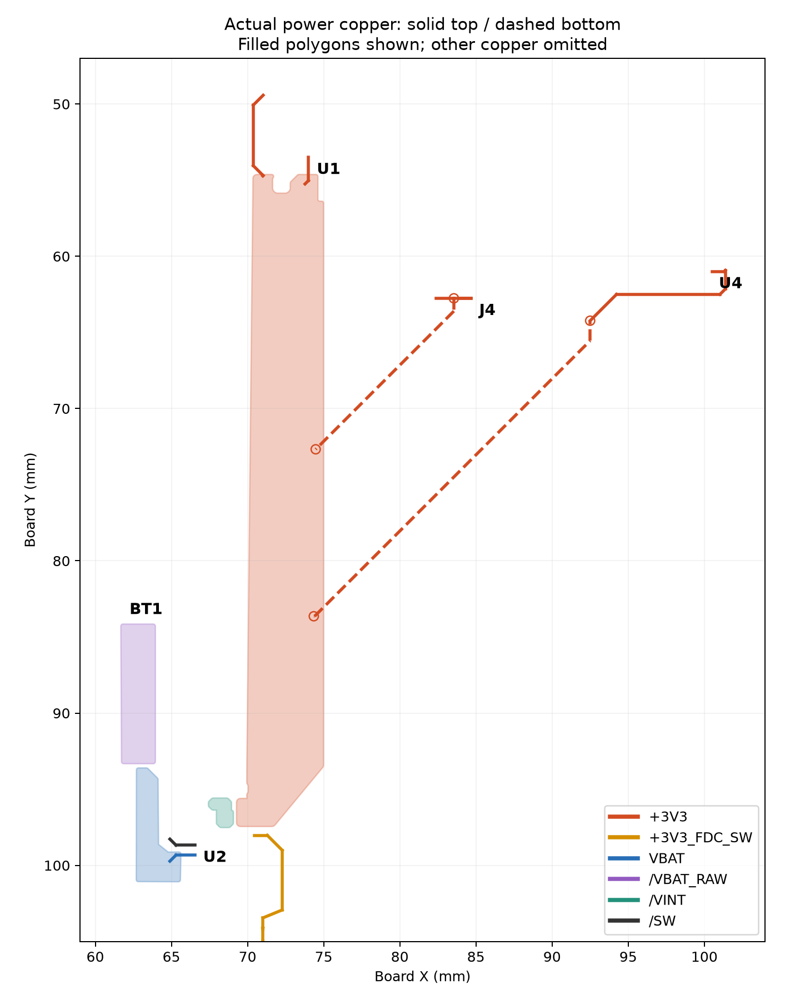
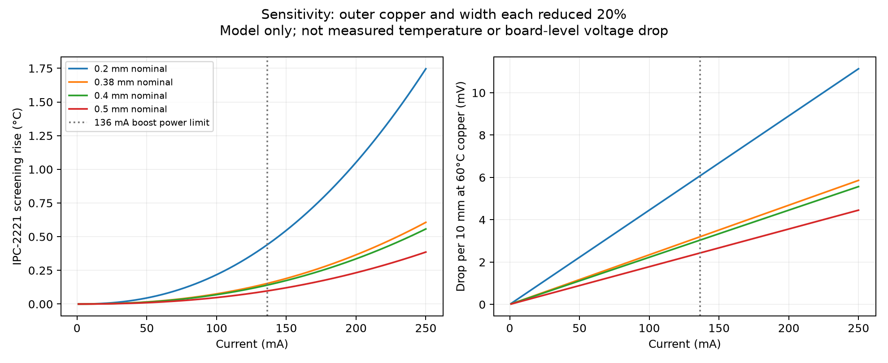

# Power copper / current review — 2026-09-05

The existing 3.3 V trace widths are comfortably adequate for the intended sensor loads. The limiting questions are CR2032 voltage droop, PMIC operating mode/output power, and simultaneous SHT45 heater plus radio/CPU operation. There is no reason to widen all 3.3 V tracks on ampacity grounds. This is an engineering screening calculation using the actual routed board, not a thermal field simulation, regulator transient simulation, or a bench test.

## Actual board and stackup

The script reads the root `.kicad_pcb`, including KiCad 10.99 footprint transforms. `copper-inventory.json` records its name and SHA-256; generated CSVs therefore identify a particular source snapshot. Existing exports and old backup boards were not used. Re-run after any routing/zone changes.

The board specifies 1.6 mm, F.Cu/B.Cu 35 µm, In1.Cu/In2.Cu 15.2 µm, and 0.0994 / 1.265 / 0.0994 mm dielectric separations, with 3313 outer prepregs. JLCPCB defaults to **1 oz outer / 0.5 oz inner**, but “standard four layer” does not uniquely select a dielectric construction. Use this board's **15.2 µm actual inner setting**, rather than silently assuming 35 µm everywhere. Confirm the selected fabrication stack in the order; this review does not certify impedance. [JLCPCB copper options](https://jlcpcb.com/help/article/jlcpcb-copper-weight), [laminated structures](https://jlcpcb.com/help/article/multi-layer-pcb-standard-laminated-structures).

| Net | Actual copper | Routed trace length, all branches | Assessment |
|---|---|---:|---|
| +3V3 | 0.4 and 0.5 mm, F/B; long F.Cu pour | 63.13 mm | Ample width; SHT branch has two 0.3 mm drilled vias |
| +3V3_FDC_SW | 0.38 and 0.4 mm, F.Cu | 10.57 mm | Far above FDC current needs; PMIC load-switch mode matters more |
| VBAT | 0.4 mm, F.Cu + solid pour | 1.80 mm | Evaluate boost input current, not just output current |
| /VBAT_RAW | F.Cu pour | No discrete tracks | Battery and reverse-polarity MOSFET dominate supply impedance |
| /VINT | F.Cu pour | No discrete tracks | Local PMIC rail; capacitance/loop layout are controlling considerations |
| /SW | 0.5 mm, F.Cu | 1.80 mm | Short; carries inductor pulse/RMS current, not simply 3V3 load current |
| GND | 0.2/0.4/0.5 mm F/B traces + four-layer fills | See generated CSV | Connectivity/return topology must pass final DRC; whole plane cannot be assigned one trace rating |
| Other signals | Mostly 0.2 mm; sense 0.25 mm; shield 0.3 mm | See CSV | Trace ampacity is not their relevant design constraint |



The filled +3V3 polygon is about 4.7–4.9 mm across much of the long trunk. After solid-connection cleanup, horizontal slices at Y=94.97/95.93/97.0 mm contain about 3.74/3.71/2.82 mm of filled copper. VBAT slices near Y=95–98 mm are about 1.43–1.46 mm; VBAT_RAW near Y=85–92.5 mm is about 2.23–2.27 mm; VINT near Y=96.5–97 mm about 1.12 mm. These are selected geometric cross-sections, **not a computed global bottleneck, current-density field, or complete plane resistance**. Pad escapes, clearances, current crowding, and return paths require separate consideration.

The initial +3V3 pour used `connect_pads no`, clearance zero, whereas VBAT/VINT/GND used solid connection. Source pad U2.13 abutted a substantial shared filled-copper edge around X=69.625 mm rather than being covered by the zone; zero-clearance edge union can conduct and was not evidence of an open circuit. The main design cleanup changed +3V3 to explicit solid connection; the latest inventory reflects that setting. Do not mistake the global 0.5 mm thermal-spoke setting for a spoke that actually exists on every pad. Pad overrides, solid connections, and actual filled geometry determine the attachment.

## Reproducible current/IR-drop sweep

Run from the repository root:

```sh
python3 docs/power-review-2026-09-05/analyze_power.py
.venv-cq/bin/python docs/power-review-2026-09-05/plot_power.py
```

The first script is standard-library Python; the second uses the existing environment's Matplotlib. `trace-widths.csv` contains every net/layer/width group. `current-sweep.csv` covers 1 mA through 1 A, nominal dimensions and an intentionally pessimistic **20% narrower AND 20% thinner** sensitivity case. This sensitivity is a modeling choice, not a claim about JLCPCB's guaranteed manufacturing tolerances. `via-sweep.csv` uses 12/18/25 µm walls. The manufacturer lists **18 µm average** hole plating; average is not a guaranteed local minimum. [JLCPCB capabilities](https://jlcpcb.com/capabilities/Capabilities).

The screening fit is `I = k × ΔT^0.44 × A^0.725`, area in square mils, k=0.048 external or 0.024 internal. It is the older IPC-2221 chart fit, not IPC-2152 and not guaranteed conservative in every geometry/enclosure. Resistivity is modeled as 0.01724 Ω·mm²/m at 20°C, temperature coefficient 0.00393/°C. IR-drop sensitivity uses copper at 60°C. [TI design guide with IPC-2221 calculation](https://www.ti.com.cn/lit/ug/tiducs7/tiducs7.pdf).

| Geometry | 10°C-rise screening current | 20% width + thickness reduction | Drop per 10 mm at 100 mA, reduced geometry, 60°C |
|---|---:|---:|---:|
| 0.38 mm outer, 35 µm | 1.19 A | 0.86 A | 2.34 mV |
| 0.40 mm outer, 35 µm | 1.23 A | 0.89 A | 2.23 mV |
| 0.50 mm outer, 35 µm | 1.45 A | 1.05 A | 1.78 mV |
| 0.25 mm outer neck, hypothetical | 0.88 A | 0.63 A | 3.56 mV |
| 0.25 mm inner neck, hypothetical, 15.2 µm | 0.24 A | 0.17 A | 8.20 mV |

The hypothetical neck rows illustrate why inner copper must not be treated like outer copper; they are not measured worst-case necks on this board. No power traces run on the inner layers in this snapshot.



For scale, the SHT supply branch after the trunk tap at (74.35,83.64) is about 38.8 mm of 0.5 mm copper and two through vias. A simple series estimate gives roughly 4.1 mV at 100 mA with nominal 20°C copper and 18 µm via walls; approximately 7.5 mV for 60°C, reduced track dimensions, and 12 µm walls. **This excludes trunk spreading resistance, solder/pad contact, ground return, and regulator/battery droop**, so it is not a board-level maximum. The sum of every +3V3 track's resistance is 68.2 mΩ at 20°C; it is an inventory statistic, not a source-to-load resistance because branches do not all lie in series.

Via calculations model `R = ρL / π[(r+t)²−r²]`, full 1.6 mm barrel length. They assess loss/drop only; applying trace ampacity formulae to via barrels would not establish a validated via current rating. At these sub-150 mA output currents barrel losses are small; a field solver is not needed to justify the existing 0.6/0.3 mm supply vias.

## Load budget and operating limits

**At 3.3 V the nPM2100 is a 450 mW maximum boost-output-power device in High Power mode, corresponding to 136 mA, not an unconditional 150 mA 3.3 V source.** Both the 450 mW condition and the ≤3.0 V / 150 mA condition require loaded VBAT ≥1.25 V. The +3V3_FDC_SW load is ultimately supplied by the boost too. [Nordic electrical specification](https://docs.nordicsemi.com/r/bundle/ps_npm2100/page/chapters/el_params/el_param_boost.html); local `doc/datasheets/nPM2100_Datasheet_v1.0.pdf`, Table 5, printed p19.

SHT45 V7.3 table 4 gives maximum heater currents of **100 / 55 / 10 mA** for nominal 200 / 110 / 20 mW heater modes; measurement without heater is ≤500 µA. Its 100 ms–1 s heater pulses cannot be supported by a few µF of decoupling alone. The maximum heater setting leaves only about **36 mA** of nominal PMIC power budget for the rest of the board. The Ezurio BL54L15 table lists radio-only peak TX about **17 mA at 3.3 V**, so CPU, peripherals, pull-ups, FDC and design margin must be added; do not treat 17 mA as total module maximum. [Ezurio datasheet](https://www.ezurio.com/documentation/datasheet-bl54l10-and-bl54l15-series); local `doc/datasheets/sensirion-sht45/HT_DS_Datasheet_SHT4x_V7.3.pdf`, table 4 and heater section.

The nPM2100 load switch is specified for 50 mA in High Power mode and **2 mA in Ultra-Low Power mode**, with typical RON changing from 0.5 Ω (specified condition: 1.8 V, OCP disabled) to 40 Ω. Firmware must choose suitable mode for FDC operation; these resistance values are operating-point-specific. Local nPM2100 table 12, printed p42. Capacitance review is covered separately; bypass and PMIC maximum **effective** capacitance must be checked together.

Input-current example, assuming 85% efficiency solely for illustration: a 120 mA × 3.3 V load requires about **155 mA from 3.0 V**, or **233 mA from 2.0 V**, before accounting for battery impedance interaction. This is far more demanding than typical low-power sensing duty cycles. The CR2032 cell's pulse/continuous capability depends on the actual cell, age, temperature and state of charge; the holder datasheet does not qualify it. Do not enable the highest heater mode by default before characterizing this. Schedule heater and radio bursts apart where possible; use the lowest effective heater level and its datasheet duty-cycle limit.

The /SW net additionally needs inductor-current waveform/RMS validation. Its 0.5 mm × 1.8 mm routing is short and low resistance, but boost input/inductor current can exceed output current by a large factor at low battery voltage. A numerical 1 A trace screening row is not permission to operate the PMIC or battery at 1 A.

## What to test on hardware

1. Use a current-limited battery emulator at BT1, then representative real CR2032 cells. Sweep fresh through depleted voltage and source resistance (e.g. 1/5/10/20/50 Ω as characterization scenarios, not claims about a specific cell). Repeat at intended hot/cold operating temperatures.
2. Measure VBAT at U2, VOUT at C25, module supply at C3, and SHT supply at C27 with short probe ground springs. Measure both steady state and dips during start-up, radio bursts, FDC enable, and each heater setting. Include simultaneous-load stress if firmware can permit it.
3. Start with heater off and modest load steps (1/10/25/50 mA), then 75/100/120 mA only where PMIC mode, power budget and battery source permit. Do not use the 1 A copper sweep as a hardware load-test instruction. Verify FDC load-switch rail when transitioning from low-power mode.
4. Record minimum rail voltages versus the actual device limits, resets/I²C errors, recovery, peak input current and average consumption. At sustained allowed loads inspect PMIC/inductor/MOSFET and cell heating; tiny predicted trace rises are not usefully validated with a casual IR-camera reading.

A real transient circuit simulation needs a suitable PMIC model or measured source impedance/response, capacitor DC-bias/ESR data, cell impedance and time-varying firmware loads. A 2D/3D copper solver would need validated filled-copper meshes and thermal boundary conditions. Neither is claimed here. Final connectivity/ERC/DRC and production layer renders remain separate release checks performed by the main design review.
