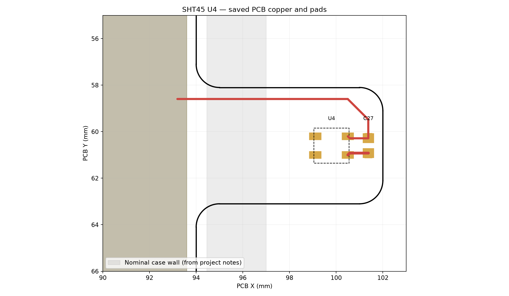

# SHT45 layout and application review

Reviewed 2026-09-04 against the saved KiCad schematic and PCB. Intended use: air above soil, no direct soil contact, sensor tab protruding outside the case. This is a design review, not a measured accuracy or ingress-protection qualification. No schematic, PCB, firmware or existing design notes were changed.

## Result

The external-tab architecture, pin assignment, land pattern and local bypass placement are appropriate. The saved PCB is not ready for fabrication: U4's SDA, SCL and supply feed are unrouted. A smaller pad-entry geometry issue should also be corrected. Thermal performance and wet-environment behavior remain prototype checks.

Red is front-layer routing; gold rectangles are pads; the dashed outline is the nominal sensor package. The gray band is the nominal enclosure wall inferred from LAYOUT.md, not a measured final enclosure. Coordinates use the PCB's current global origin. The picture shows the missing SDA/SCL and supply feed.

## Findings requiring action

### 1. Complete U4 routing — fabrication blocker

The schematic/netlist connects U4.1 to SDA, U4.2 to SCL, U4.3 to always-on +3V3 and U4.4 to GND, correctly matching datasheet section 5.4. R22/R23 provide 4.7 kΩ pull-ups to the same +3V3 rail. C27 is connected between +3V3 and GND.

The PCB currently has no tracks reaching U4.1 or U4.2. U4.3 connects locally to C27.1 but has no supply feed from the main board. Ground has a front-layer trace back toward the main board. KiCad's fresh DRC confirms unconnected +3V3, SDA and SCL involving U4. This is incomplete routing, not a schematic pinout error.

Complete these connections while keeping the sensor center copper-free. Then run fresh DRC and schematic parity checks. The audit DRC found 26 violations and 19 unconnected items across the entire board, with zero schematic parity issues. Those totals include unrelated board work; they are not 45 SHT45 defects. The report is in [drc.json](drc.json).

### 2. Narrow and align the power-pad entries — small layout correction

Sensirion's datasheet section 5.3 / Figure 17 specifies copper under the package only at the pin pads. The central die area is clear and there is no central thermal pad, but the final VDD/GND traces spread beyond the pin-pad rectangles beneath the nominal package:

- VDD entry: 0.40 mm track into a 0.30 mm-high pad, with a short offset bend from (100.58,60.92) to (100.50,61.00).
- GND entry: 0.30 mm track into a 0.30 mm-high pad, offset toward y=60.28 before entering the pad centered at y=60.20.

A geometric intersection check of saved tracks, vias and filled zones against the nominal 1.5 × 1.5 mm package, excluding the four pad rectangles, finds these two local entries as the copper encroachment. It finds no vias or filled planes under the sensor. This is a small perimeter encroachment, not a copper heat sink beneath the central die.

Use short, centered entries of about 0.20 mm width at U4.3 and U4.4, widening only outside the package if needed. That width is an engineering recommendation, not a mandatory Sensirion dimension. The current NoCopperSHT45 and SHT45_Jut rule areas allow tracks, so their names do not guarantee compliance. A dedicated center keepout prohibiting tracks would guard against later routing through the die area.

### 3. Correct stale component documentation

The product-page date label says April 2025, but the PDF downloaded from its link is **datasheet v7.3, June 2026**. Its revision history explicitly corrects PTFE to **polyimide**. Section 6.1 describes a nominal 40 µm membrane and protection according to IP68. The project still describes PTFE, 100 µm and IP67 in HARDWARE.md, BOM.md and LAYOUT.md. Retain SHT45-AD1F-R2; correct those descriptions rather than changing the part.

The membrane does not establish an IP rating for the exposed pads, PCB, or case-wall passage. Likewise, it does not authorize board washing or coating over the sensor opening. The newer datasheet takes precedence over older application-note membrane descriptions.

The membrane-equipped package height is 0.63 ±0.1 mm in Figure 16, rather than the bare-package 0.5 mm stated in HARDWARE.md. Account for this if adding a guard or shield.

## Checks that pass or support the design

| Check | Saved-design evidence | Assessment |
|---|---|---|
| Land pattern | Four 0.50 × 0.30 mm pads; column centers 1.40 mm apart; row centers 0.80 mm apart | Matches Figure 17 exactly |
| Pin assignment | 1 SDA, 2 SCL, 3 VDD, 4 GND | Matches section 5.4 |
| Power domain | U4 and bus pull-ups use +3V3, not switched FDC supply | Correct topology; actual supply waveform still needs measurement |
| Bypass | C27, 100 nF X7R at (101.38,60.60); U4 at (99.80,60.60) | Good local placement, 1.58 mm center-to-center; short connections |
| Central die | No central pad, track or via; no saved plane fill underneath | Correct; perimeter trace issue described above |
| Plane isolation | No plane copper on the sensor tab; main fill stops near x=93.6 | Follows design-guide advice to reduce metal conduction |
| Air access | Sensor body beyond nominal wall outer face x=97 | Supports intended external-air measurement |

The nearest nominal sensor body edge is x=99.05, about **2.05 mm beyond** the documented outer wall face. Sensor center is 2.80 mm beyond it. These are derived clearances, conditional on the case placement matching the notes. LAYOUT.md's 1.58 mm wall-projection figure does not match this nominal body calculation.

The 4.7 kΩ pull-ups are above the datasheet minimum resistance. At 400 kHz, its rise-time relation gives a total bus-capacitance budget of approximately **75 pF** (300 ns / (0.8473 × 4700 Ω)). That is a conditional electrical check, not proof of timing compliance: scope SDA/SCL after routing, including every device on the shared bus.

## Application-specific recommendations

### Thermal isolation and what the measurement represents

Sensirion's design guide section 3 recommends separation from heat sources, thin copper connections, reduced PCB conduction, and protection from heated air and radiation. The 8 mm-long, 5 mm-wide protrusion and absence of planes follow that direction. The rigid 1.6 mm board still conducts heat, so geometry alone cannot establish ±0.1 °C system accuracy.

Keep the tab and opening unobstructed. If sunlight or grow-light radiation reaches it, use a ventilated shade that blocks radiation without trapping warm air or contacting the package. Seal the wall passage with a qualified, fully cured material if necessary to keep case air or water from passing through; avoid a large conductive potting mass around the sensing tip. A narrower neck or slots are optional improvements if thermal testing shows excessive coupling, not an automatic redesign requirement.

Air immediately above moist soil can have a different temperature/RH from room air. That is appropriate if local plant-level air is the target. It also means **this sensor does not directly measure soil temperature**. HARDWARE.md's soil-permittivity compensation argument should not assume that ±0.1 °C air-sensor accuracy yields ±0.1 °C soil-temperature knowledge.

### Water, contamination and assembly

No soil contact removes the need to design this sensor as a buried probe, but condensation and watering droplets can still occur. Retain the membrane option. Arrange the installed device or a small ventilated guard so droplets drain rather than remain over the opening. Liquid remaining on the surface can delay useful ambient-RH readings even if it does not damage the sensor.

For exposed conductors, consider a qualified coating process that protects the solder joints and traces while leaving the sensor top uncoated. The handling guide calls for no board wash, suitable no-clean soldering, avoiding cleaning-agent exposure, and full curing/ventilation of coatings and adhesives. A permanent membrane is not the removable process cover. Keep fertilizer sprays, pesticides and cleaning products away from the opening; evaluate actual chemical exposure if those are expected.

### Heater and high-humidity operation

Do not enable periodic heating by default on this coin-cell design. Long exposure above the recommended humidity range can cause reversible RH offset (datasheet section 2.3 gives +3 %RH after 60 h above 80 %RH as an example). A membrane does not remove this mechanism.

If heater recovery is implemented, qualify the complete battery/PMIC path under pulse load. Table 4 lists the highest heater setting at **60 mA typical / 100 mA maximum**; the existing “up to 60 mA” project wording understates that table. Section 4.9 also mentions approximately 75 mA, so size the supply using the tabulated maximum rather than the lower narrative figure. At 3.3 V this is up to 330 mW at the sensor, before conversion losses.

Respect the current datasheet's 10% lifetime duty limit, permitted ambient temperature and 125 °C chip-temperature ceiling. Do not report heater-command readings as ambient measurements; take a new unheated measurement after thermal recovery. Determine recovery time on the actual tab. The older creep note's aggressive single-shot pulse example and the heater-decontamination note's extended laboratory heating are not default production schedules for this battery device.

The inspected firmware/bthome-sensor/src/main.c currently generates simulated temperature and humidity in sim_values(); it does not establish SHT45 command timing, CRC handling, heater policy or cooldown behavior.

## Prototype verification before release

1. Finish routing and correct pad entries; re-run DRC with zone refill and check the final fabrication outputs.
2. Verify supply and I²C waveforms during sensor reads and radio activity. Include low battery and any heater use.
3. Compare the assembled device with a sufficiently accurate reference close to U4 in stable air, allowing equilibration. Compare sleeping versus active-radio operation and case/lighting temperature changes. Separate reference uncertainty from DUT error.
4. Test high humidity and representative watering/condensation exposure, checking recovery after droplets clear. Do not use direct breathing on the sensor as a calibration test.
5. Repeat comparison after the real assembly, coating and enclosure process to detect contamination or thermal bias.

No physical measurements were performed. Review evidence includes the fresh schematic netlist, KiCad DRC, saved-copper geometry check and visual inspection of the manufacturer's land-pattern and thermal-layout drawings. Source file hashes are recorded in [source-hashes.json](source-hashes.json).

## Manufacturer references

All PDFs are saved in [the reference directory](../../doc/datasheets/sensirion-sht45/README.md), with original URLs and SHA-256 hashes.

- [SHT4x datasheet v7.3](../../doc/datasheets/sensirion-sht45/HT_DS_Datasheet_SHT4x_V7.3.pdf): sections 2.3, 3/Table 4, 4.9, 5.2–5.4 and 6.1; Figures 16–18.
- [Design-in guide](../../doc/datasheets/sensirion-sht45/Sensirion_Humidity_Temperature_Design_Guide.pdf): sections 2.3–2.4, 3, 4.2–4.4 and 5–7.
- [Handling instructions](../../doc/datasheets/sensirion-sht45/HT_Handling_Instructions_SHTxx.pdf): assembly/coating and field handling.
- [Contamination guide](../../doc/datasheets/sensirion-sht45/HT_AN_Contamination_Guide.pdf): contamination pathways and mitigation.
- [Creep mitigation](../../doc/datasheets/sensirion-sht45/Application_Note_Creep_Mitigation_SHT4x.pdf): recovery/equilibration and application-dependent heating.
- [Heater decontamination](../../doc/datasheets/sensirion-sht45/HT_AN_Heater_Decontamination_SHT4x.pdf): thermal isolation and experimental recovery.
- [Ambient testing](../../doc/datasheets/sensirion-sht45/Sensirion_Humidity_Sensors_Testing_at_Ambient_Conditions.pdf): reference placement, gradients and equilibration.
- [Specification and testing](../../doc/datasheets/sensirion-sht45/Sensirion_AppNotes_Sensors_Specification_Statement.pdf): interpreting sensor specifications and test conditions.
